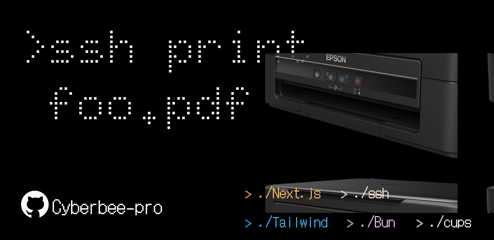

# Print Console Extension

A modular, full-stack monorepo interface designed to extend an automated operating system printing and storage pipeline. This system acts as an isolated network ingress layer that routes document file uploads directly into a secured local filesystem drop zone, allowing underlying systemd daemons and printing spoolers to process execution commands asynchronously.

The project is structured as a decoupled monorepo using Bun Workspaces, separating the user interface from the system runtime backend.



---

## Architecture Overview

```
[ Client Browser ] ──► [ Next.js Frontend ]
                             │
                             ▼ (HTTP POST Multipart Stream)
                       [ Bun API Backend ]
                             │
                             ▼ (Atomic Write)
                       [ System Drop Zone ] ──► [ inotify / systemd ] ──► [ CUPS Spooler ]

```

---

## Directory Structure

```text
.
├── packages/
│   ├── web-console/         # Next.js Frontend UI Application
│   │   ├── src/
│   │   └── package.json
│   └── print-backend/       # Bun Runtime Network Gateway API
│       ├── src/
│       └── package.json
├── package.json             # Root Workspace Orchestrator
└── README.md

```

---

## Prerequisites

* **Runtime**: Bun installed globally on the host machine.
* **Core Base (Target Machine)**: A Linux environment configured with CUPS, a target drop zone directory, and access permissions for the executing processes.

---

## Configuration & Environment Variables

This project uses a modular design. To deploy an instance, fork the repository and establish local environment profiles for each layer.

### Backend Configuration

Create a `.env` file inside `packages/print-backend/`:

```env
# Network Configuration
PORT=your_frontend_port
HOST=your_frontend_host

# Filesystem Targets
DROP_ZONE_PATH="path_to_server_storage"
STORAGE_POOL_PATH="/path_to_/PrintConsoleStorage"
```
#recomended architecture
```
PrintConsoleStorage
|-/received
|-/queue 
|-/printed
```

```
# Remote Gateway Tracking (Optional)
SSH_ENABLED=false
SSH_HOST="your_ssh_host_address"
SSH_PORT= your_ssh_port : eg - 3844
SSH_USER="your_print_console_user"
SSH_KEY_PATH="/path/to/identity/key"

```

### Frontend Configuration

Create a `.env.local` file inside `packages/web-console/`:

```env
# API Gateway Routing
NEXT_PUBLIC_API_URL="http://localhost:5000"

```

---

## Deployment & Getting Started

### 1. Clone the Workspace

```bash
git clone <your-forked-repo-url>
cd cybees-homelab

```

### 2. Install Project Dependencies

Run the installation command from the project root directory. Bun will automatically scan the workspaces config and install package bundles across both layers simultaneously:

```bash
bun install

```

### 3. Execution Control

#### Development Environment

To spin up both applications concurrently with hot-reloading active:

```bash
bun dev

```

#### Production Build & Run

To compile production-optimized layers and initialize the network endpoints:

```bash
# Build layers
bun run build

# Start persistent gateway daemons
bun run start

```

---

## System Automation Integration Reference

To connect this application gateway to your host's processing engine, ensure your backend `DROP_ZONE_PATH` aligns with your systemd monitoring structures.

### Systemd Path Configuration Example

```ini
[Unit]
Description=Monitor Ingress Drop Zone Event Loop

[Path]
DirectoryNotEmpty=/home/printConsole
Unit=printconsole-move.service

[Install]
WantedBy=multi-user.target

```

### Systemd Service Configuration Example

```ini
[Unit]
Description=Process and Spool Drop Zone Inputs
After=cups.service

[Service]
Type=oneshot
ExecStart=/usr/local/bin/print-processor-script.sh
User=root

```
